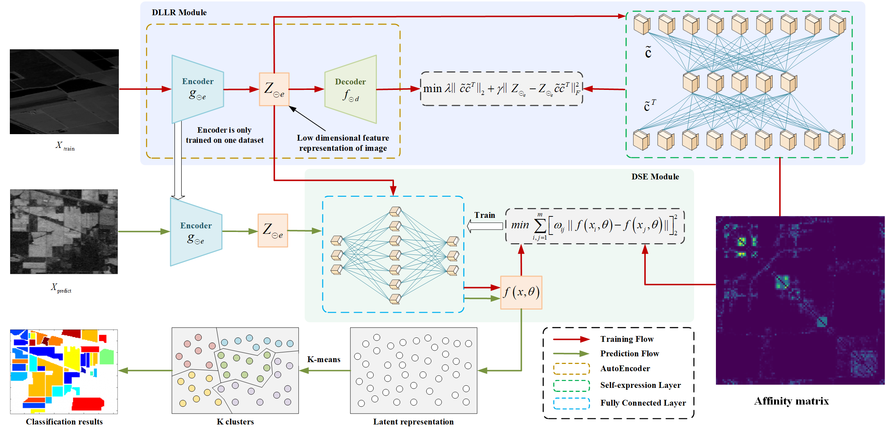

# Scalable Deep Low-Rank Subspace Network for Hyperspectral Images Clustering

This repository contains the source code for the paper *Scalable Deep Low-Rank Subspace Network for Hyperspectral Images Clustering*.

**Code is coming soon!**

## Overview
The paper introduces a scalable deep learning model designed for clustering hyperspectral images using low-rank subspaces. The model is efficient and scalable, making it suitable for large-scale datasets.

## Flowchart

> The flowchart above illustrates the overall pipeline of the proposed method, from data input to clustering output.
